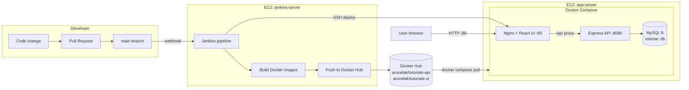

# Three-Tier Application — Docker, Jenkins & AWS CI/CD

An end-to-end DevOps project: a three-tier CRUD web application (React + Node.js/Express + MySQL) containerized with Docker, run locally with Docker Compose, and deployed to AWS EC2 through a fully automated Jenkins CI/CD pipeline.

> Forked from [bezkoder/docker-compose-react-nodejs-mysql](https://github.com/bezkoder/docker-compose-react-nodejs-mysql) and extended with production deployment, CI/CD automation, and AWS infrastructure. See [docs/troubleshooting.md](docs/troubleshooting.md) for the issues found and fixed along the way.

## The application

A **Tutorials manager** — full CRUD: create, list, search, update, publish/unpublish, and delete tutorials.

| Tier | Technology | Container |
|------|-----------|-----------|
| Presentation | React 16 served by Nginx (also reverse-proxies `/api`) | `bezkoder-ui` |
| Application | Node.js / Express / Sequelize REST API | `bezkoder-api` |
| Data | MySQL 8.0 with a persistent Docker volume | `mysqldb` |

## Architecture



More detail: [docs/architecture.md](docs/architecture.md)

## Run locally

Prerequisites: Docker Desktop (or Docker Engine + Compose v2).

```bash
git clone https://github.com/mkandasamy/three-tier-devops-project.git
cd three-tier-devops-project
cp .env.example .env        # adjust values if you like
docker compose up -d --build
```

- UI: http://localhost:8888
- API (direct): http://localhost:6868/api/tutorials
- API (through the Nginx proxy, as production works): http://localhost:8888/api/tutorials
- MySQL: localhost:3307 (root / password from `.env`)

Stop with `docker compose down` (add `-v` to also wipe the database volume).

## CI/CD pipeline

Defined in the [Jenkinsfile](Jenkinsfile). Trigger: GitHub webhook on every push to `main`.

1. **Checkout** — pull the latest `main`
2. **Build Images** — build API and UI images, tagged `:<build number>` and `:latest`
3. **Push to Docker Hub** — authenticated with a Jenkins-stored access token
4. **Deploy to AWS** — copy `docker-compose.prod.yml` to the app server over SSH, then `docker compose pull && up -d`
5. **Smoke Test** — curl the UI and the API through the public URL; the build fails if either is down

## Git workflow

- `main` — deployable; every merge triggers a deployment
- `dev` — integration branch
- `feature/*` — all work happens here, merged into `dev` via Pull Requests, then released `dev → main` via PR

## AWS infrastructure

Provisioned entirely from script — see [infra/provision.sh](infra/provision.sh):

- 2 × EC2 t3.micro (Ubuntu 24.04): `jenkins-server` (Jenkins LTS, Java 21, Docker) and `app-server` (Docker + Compose)
- Security groups: SSH restricted to the admin IP; Jenkins :8080 for UI/webhooks; app :80 public
- Bootstrap via cloud-init user-data ([infra/jenkins-userdata.sh](infra/jenkins-userdata.sh), [infra/app-userdata.sh](infra/app-userdata.sh)), including swap sizing for t3.micro
- Cost guardrail: AWS Budget with email alert

Setup steps: [docs/setup-guide.md](docs/setup-guide.md) · Issues hit and fixed: [docs/troubleshooting.md](docs/troubleshooting.md)
