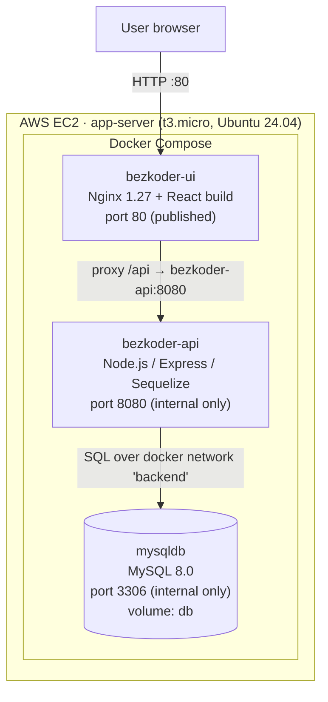
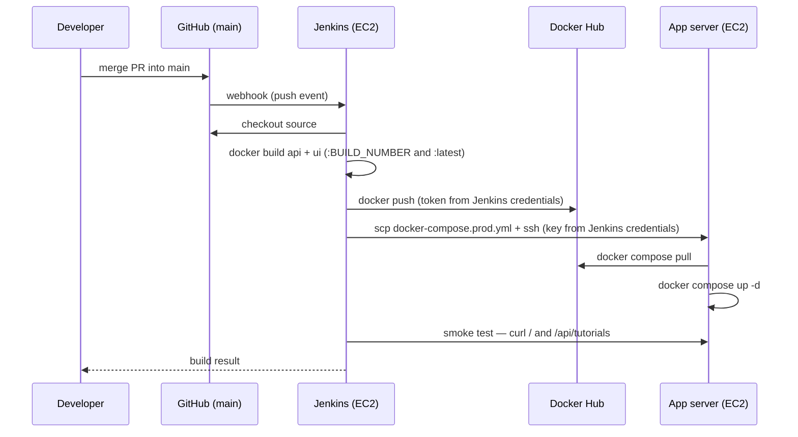

# Architecture

## Application: three tiers

Design points:

- **Single public entry point.** Only port 80 is exposed. The browser loads the React app from Nginx and calls the API at the relative path `/api`, which Nginx reverse-proxies to the backend container. The API and database are unreachable from the internet.
- **Network segmentation.** Two Docker networks: `frontend` (UI ↔ API) and `backend` (API ↔ DB). The UI container cannot reach MySQL at all.
- **Data persistence.** MySQL data lives in the named volume `db`, so it survives container restarts and redeployments.
- **Startup ordering.** The API waits for the MySQL healthcheck (`service_healthy`) and additionally retries its initial schema sync, because MySQL 8's first boot briefly answers before networking is ready.

## CI/CD flow

## AWS resources

| Resource | Value |
|----------|-------|
| Region | us-east-1 |
| jenkins-server | EC2 t3.micro, Ubuntu 24.04, 12 GB gp3, 2 GB swap |
| app-server | EC2 t3.micro, Ubuntu 24.04, 12 GB gp3, 1 GB swap |
| jenkins-sg | 22/tcp from admin IP · 8080/tcp open (login-protected UI + GitHub webhooks) |
| app-sg | 22/tcp from admin IP and from jenkins-sg · 80/tcp public |
| Key pair | `devops-key` (ed25519) |
| Budget | $5/month, email alert at 80% |

Both instances are **stopped (not terminated)** outside working/review sessions. Public IPs change on restart — after starting, update `APP_SERVER`/`APP_URL` in the Jenkinsfile and the webhook URL in GitHub if the Jenkins IP changed.
